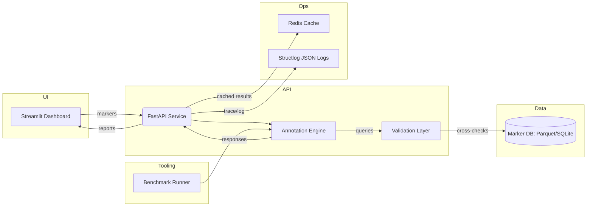

# Architecture Overview

## Diagram

## Components

- **Frontend (Streamlit):** Collects marker inputs, invokes API/local engine, renders annotations, explanations, and warnings.
- **API Service (FastAPI):** Exposes REST endpoints for single/batch annotation, health checks, and integrates logging, auth, and validation middleware.
- **Annotation Engine:** Encapsulates prompt construction, OpenAI GPT-4o calls, retry/backoff logic, and response parsing.
- **Retrieval Layer:** Queries the marker knowledge base (SQLite) to retrieve top candidate labels and supporting markers, feeding them into retrieval-augmented prompts.
- **Validation Layer:** Cross-checks LLM predictions with the marker knowledge store, flags contradictions, and produces structured reports.
- **Marker Knowledge Store:** Normalized SQLite/Parquet database built from PanglaoDB, CellMarker, and curated literature entries.
- **Benchmark Toolkit:** Runs evaluation datasets through the engine, computes metrics, and generates markdown/HTML summaries.
- **Config & Secrets:** Centralized via `config/settings.py` using environment variables for API keys, model selection, caching options.

## Data Flow

1. User uploads marker lists or selects clusters via UI/API.
2. API forwards payload to Annotation Engine, which formats prompts and queries GPT-4o.
3. Engine returns candidate labels with rationales; Validation Layer verifies against marker DB.
4. Responses (including warnings and confidence) return to API/UI and are optionally logged for auditing.
5. Benchmark Toolkit reuses the engine to score labeled datasets and informs prompt/DB updates.

## Retrieval-Augmented Prompting

To reduce hallucinations and improve calibration, GPT Cell Annotator performs a lightweight
retrieval step before crafting prompts:

1. Marker genes are normalised using HGNC aliases and optional human↔mouse ortholog mappings
   defined in `config/gene_synonyms.json`.
2. The retriever executes a SQLite query over the marker database to find cell types with
   overlapping markers, respecting the dataset's species/tissue context.
3. The top-k candidates (label, ontology ID, supporting markers, tissue frequencies) are embedded
   into the prompt so the LLM must explicitly accept or reject each option.
4. Retrieval can be disabled or tuned via the `RAG_*` settings in `config/settings.py`, and
   results are cached per marker set to minimise latency.

## Non-Functional Considerations

- **Scalability:** Stateless API with optional async queue for batch jobs; caching frequent annotations.
- **Security:** Marker-only inputs, no PII; secrets via env vars; audit logs configurable.
- **Extensibility:** LLM client abstracted to support local models; knowledge store loaders modular for new sources.
