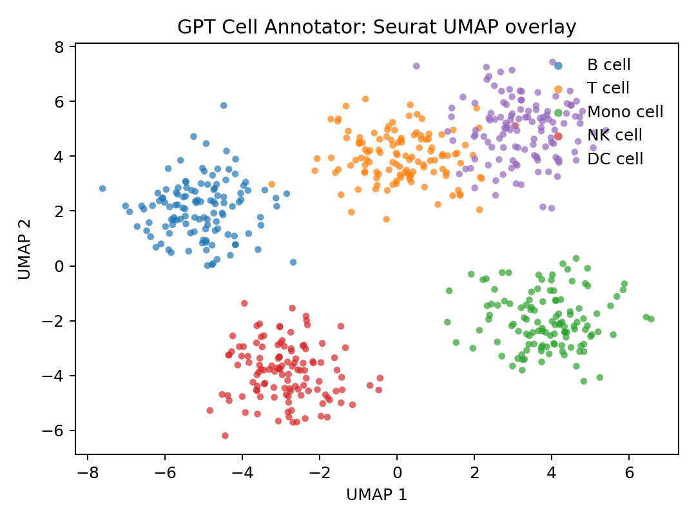

# Seurat Integration Guide

Bring GPT Cell Annotator into your Seurat pipelines for reproducible, guardrailed cell typing. This guide highlights installation paths, end-to-end workflows, and troubleshooting so you can move from marker discovery to validated annotations quickly.

> Need the Python/Scanpy path instead? See [`docs/scanpy_integration.md`](docs/scanpy_integration.md) for the sister workflow.

## Prerequisites

- R ≥ 4.3 with dev headers for `libcurl`, `openssl`, and `xml2`.
- Pandoc ≥ 2.11 (bundled with RStudio or install separately).
- Seurat ≥ 5.0; install via `pak::pkg_install("Seurat")` or Bioconductor mirror.
- Optional: `gca` CLI from `pip install gpt-cell-annotator` for offline fallback.

## Install the R Package

```r
if (!require("pak")) install.packages("pak")
pak::pkg_install("github::jameshyojaelee/CellAnnot-GPT@main?subdir=clients/r/gptcellannotator")

# Alternate: remotes::install_github("jameshyojaelee/CellAnnot-GPT", subdir = "clients/r/gptcellannotator", build = TRUE)
```

Helper scripts live in `clients/r/scripts/`:

- `Rscript clients/r/scripts/install_github.R [ref]`
- `Rscript clients/r/scripts/install_local_tarball.R`

The pkgdown site (<https://jameshyojaelee.github.io/CellAnnot-GPT/r>) mirrors all exported functions, configuration helpers, and the Seurat vignette.

## Quickstart Workflow

```r
library(Seurat)
library(gptcellannotator)

pbmc <- readRDS("pbmc_seurat.rds")

markers <- FindAllMarkers(pbmc, min.pct = 0.25, logfc.threshold = 0.25)

cfg <- gptca_config(
  base_url = "https://api.gpt-cell-annotator.org",
  api_key = Sys.getenv("GPTCA_API_KEY"),
  offline = FALSE
)
gptca_config_set(cfg)

annotations <- gptca_annotate_seurat(
  pbmc,
  markers = markers,
  species = "Homo sapiens",
  return_validated = TRUE
)

pbmc <- gptca_add_metadata(pbmc, annotations)
gptca_plot_umap(pbmc)
```



Key outputs:
- `annotations$clusters` summarises status (`supported`, `flagged`, `unknown`) and canonical markers.
- `pbmc@meta.data` gains `gptca_label`, `gptca_confidence`, `gptca_status`, and validation notes.
- `gptca_plot_umap()` overlays annotations and warning glyphs for rapid triage.

## REST vs Offline CLI

- **REST mode** (default) posts payloads via `httr2` to the FastAPI backend. Configure `GPTCA_BASE_URL`/`GPTCA_API_KEY` or use `gptca_config()`.
- **Offline CLI fallback** (`offline = TRUE` or `GPTCA_CLI_PATH`) writes markers to a temp file and shells out to `gca annotate`. Ensure the Python CLI is installed and discoverable via `Sys.which("gca")`.

Both flows share the same validation guardrails and schema as the Python tooling, keeping annotations consistent across teams.

## Continuous Documentation

- Browse the pkgdown articles (`annotate-seurat`) for screenshots, API surface, and configuration recipes.
- The vignette renders during CI (`R CMD check --as-cran` on Ubuntu + macOS) so regressions surface early.
- Cross-links back to Scanpy documentation help you compare R and Python outputs in mixed-language teams.

## Troubleshooting

| Symptom | Resolution |
| --- | --- |
| `curl::curl_fetch_memory` SSL errors | Install system OpenSSL (`brew install openssl`, `sudo apt-get install libssl-dev`) and restart R. |
| `gca` binary not found during offline runs | Install the Python package (`pip install gpt-cell-annotator`) and ensure the CLI directory is on `PATH`. |
| Vignette build fails with `Pandoc not found` | Install Pandoc ≥ 2.11 (`brew install pandoc`, `choco install pandoc`) or set `RSTUDIO_PANDOC`. |
| Empty annotations for clusters | Increase markers per cluster (`top_n_markers`) or validate that `FindAllMarkers()` produced positive markers. |
| API 401 responses | Export `GPTCA_API_KEY=...` before starting R or pass `api_key` to `gptca_config()`. |

Still stuck? Open an issue at <https://github.com/jameshyojaelee/CellAnnot-GPT/issues> with the output of `sessionInfo()`.

## Next Steps

1. Review the QA matrix in [`docs/reports/seurat_integration/QA.md`](reports/seurat_integration/QA.md).
2. Sync schema expectations with Python via [`docs/scanpy_integration.md`](docs/scanpy_integration.md).
3. Subscribe to release notes (see `docs/reports/seurat_integration/announcement.md`) to track future Seurat enhancements.
